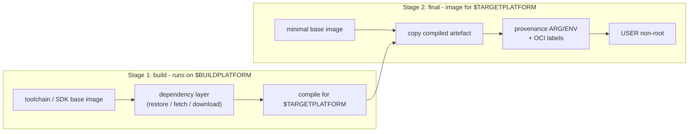
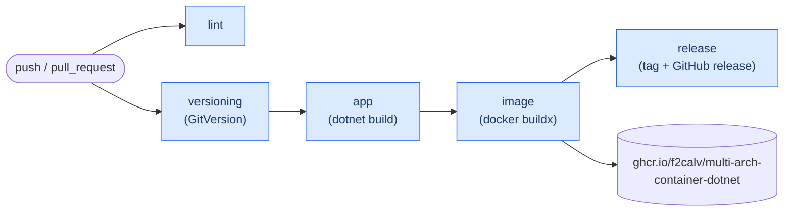

# Multi-Architecture Container Image w/.NET

Building a **.NET** application container image that targets `linux/amd64`, `linux/arm64` and `linux/arm/v7` - all from a **single** [Dockerfile](Dockerfile).

If you find this repository useful then give it a :star: ... :wink:

## Introduction

I've been developing a service orientated smart home system which consists of a number of containerised workloads running on an edge Kubernetes cluster (via [k3s](https://k3s.io/)), the "cluster" comprises two Raspberry Pi 4b (ARMv8).

As well as running multiple workloads on the Pi 4b I also run workloads on another Raspberry Pi 2b (ARMv7) which is much older (but very power efficient). And finally I also need to run general tests of the workloads on my local Windows development machine prior to deployment to my "Production cluster", and at a later date I may even want to run these workloads on [Azure Kubernetes Service](https://azure.microsoft.com/en-us/products/kubernetes-service/).

Although I could achieve my goal of deploying the same application to multiple architectures using separate Dockerfiles (i.e. Dockerfile.amd64, Dockerfile.arm64, etc...) in my view that is messy and makes the CI/CD more complex. I think the single Dockerfile is the elegant approach keeping all build instructions in one place.

## Sibling Repositories

The same trivial worker application is implemented three times, once per language. The repository layout, file names, CI workflow and even the Dockerfile comments are kept as close to identical as possible - so a developer fluent in one language can learn another language's containerisation story simply by diffing two repositories.

| Repository | Language | Build image | Final image | Cross-compilation mechanism |
| --- | --- | --- | --- | --- |
| [multi-arch-container-dotnet](https://github.com/f2calv/multi-arch-container-dotnet) | C# / .NET 10 | `mcr.microsoft.com/dotnet/sdk:10.0` | `mcr.microsoft.com/dotnet/runtime:10.0-noble-chiseled` | `dotnet publish -r <RID>` |
| [multi-arch-container-go](https://github.com/f2calv/multi-arch-container-go) | Go | `golang:1-bookworm` | `gcr.io/distroless/static-debian12:nonroot` | `GOOS` / `GOARCH` / `GOARM` |
| [multi-arch-container-rust](https://github.com/f2calv/multi-arch-container-rust) | Rust | `rust:1-bookworm` | `gcr.io/distroless/cc-debian12:nonroot` | `rustup target` + GNU cross linker |

These repositories are **application code only** - Kubernetes packaging lives in the standalone [f2calv/helm-charts](https://github.com/f2calv/helm-charts) repository, which provides a single multi-purpose chart used by all three.

## Goals

- Construct a .NET multi-architecture container image via a single Dockerfile using the `docker buildx` command.
- Demonstrate idiomatic **structured logging** and **layered configuration** in each language, wired identically.
- Create a single GitHub Actions workflow [ci.yml](.github/workflows/ci.yml) to handle all tasks and host the reusable workflows in an external [gha-workflows](https://github.com/f2calv/gha-workflows) repository.

  - Auto-Semantic Versioning
  - Build App
  - Build Container + Push To GitHub Packages
  - GitHub Release

## Platform Mapping

RID is short for [Runtime Identifier](https://learn.microsoft.com/dotnet/core/rid-catalog). `docker buildx` injects `TARGETARCH` and `TARGETVARIANT` into the build, and the Dockerfile maps them onto a RID:

| Docker platform | `TARGETARCH` | `TARGETVARIANT` | .NET RID | Typical hardware |
| --- | --- | --- | --- | --- |
| `linux/amd64` | `amd64` | *(empty)* | `linux-x64` | Most desktop/server distributions |
| `linux/arm64` | `arm64` | *(empty)* | `linux-arm64` | Raspberry Pi 3+ on 64-bit Ubuntu/Debian, Apple Silicon, AWS Graviton |
| `linux/arm/v7` | `arm` | `v7` | `linux-arm` | Raspberry Pi 2+ on 32-bit Raspberry Pi OS |

## Anatomy of the Dockerfile

All three sibling repositories share the same two-stage shape:



The five ideas worth stealing:

1. **Cross-compile, don't emulate.** The build stage is pinned with `FROM --platform=$BUILDPLATFORM`, so it always runs natively on the builder and produces output for the target. Letting buildx run the whole build under QEMU emulation instead is typically 10-50x slower.
2. **Split dependency resolution from compilation.** `dotnet restore` runs against a layer containing only `*.csproj` and `Directory.*.props`, so editing a `.cs` file reuses the cached restore. Restore is platform-agnostic and deliberately happens *before* `TARGETARCH` is introduced, so all three architectures share it.
3. **Switch on `TARGETARCH` + `TARGETVARIANT`, not `TARGETPLATFORM`.** Concatenating the two produces a single flat token (`amd64`, `arm64`, `armv7`) that a `case` statement handles in three lines, instead of comparing full `linux/arm/v7`-style strings.
4. **Use BuildKit cache mounts.** `--mount=type=cache` keeps the NuGet package cache outside the image layers - it survives across builds without bloating the result.
5. **Ship a minimal, non-root final image.** The chiseled base has no shell and no package manager, and the container runs as `$APP_UID` (1654).

## Logging

Structured logging is provided by [Serilog](https://serilog.net/), which takes ownership of the `Microsoft.Extensions.Logging` pipeline. Application code therefore only ever depends on `ILogger<T>` - Serilog could be swapped out without touching a single service.

```csharp
logger.LogInformation("{ClassName} git provenance, Repository={GitRepository} Branch={GitBranch}",
    nameof(WorkerService), buildInfo.Value.GitRepository, buildInfo.Value.GitBranch);
```

The equivalent in the sibling repositories:

| | .NET | Go | Rust |
| --- | --- | --- | --- |
| Library | Serilog (behind `ILogger<T>`) | `log/slog` (standard library) | `tracing` + `tracing-subscriber` |
| Text/JSON switch | `app:log_format` | `app.log_format` | `app.log_format` |
| Verbosity | `Serilog:MinimumLevel` in `appsettings.json` | `LOG_LEVEL` env var | `RUST_LOG` env var |

Set `APP__LOG_FORMAT=json` to emit newline-delimited JSON instead of human-readable console output:

```bash
docker run --rm -e APP__LOG_FORMAT=json ghcr.io/f2calv/multi-arch-container-dotnet
```

## Configuration

Configuration is layered by [Microsoft.Extensions.Configuration](https://learn.microsoft.com/dotnet/core/extensions/configuration), in ascending order of precedence:

1. Property defaults on the `AppConfig` record.
2. [`appsettings.json`](src/multi-arch-container-dotnet/appsettings.json).
3. Environment variables.
4. Command line arguments.

Values are bound to validated `IOptions<T>` records with `ValidateDataAnnotations().ValidateOnStart()`, so a bad value fails fast at startup rather than surfacing later.

| Key | Environment variable | Default | Description |
| --- | --- | --- | --- |
| `app:greeting` | `APP__GREETING` | `Hello from a multi-architecture container` | Message logged each iteration |
| `app:interval_seconds` | `APP__INTERVAL_SECONDS` | `3` | Delay between iterations |
| `app:log_format` | `APP__LOG_FORMAT` | `text` | `text` or `json` |

Keys are **snake_case**, not PascalCase, and mapped onto idiomatic C# property names with `[ConfigurationKeyName]`. That is deliberate: the Go and Rust configuration libraries lower-case environment keys, so snake_case is the only casing where the file key and the environment key resolve identically in all three languages.

Build provenance is a second, flat set of variables baked into the image by the `ARG`/`ENV` block of the [Dockerfile](Dockerfile) (populated by CI, or by `build.sh`/`build.ps1` locally). The same names are used by all three sibling repositories.

| Environment Variable | Description |
| --- | --- |
| `GIT_REPOSITORY` | Git repository name |
| `GIT_BRANCH` | Git branch name |
| `GIT_COMMIT` | Git commit SHA |
| `GIT_TAG` | Git tag |
| `GITHUB_WORKFLOW` | GitHub Actions workflow name |
| `GITHUB_RUN_ID` | GitHub Actions run ID |
| `GITHUB_RUN_NUMBER` | GitHub Actions run number |

## Run Pre-Built Container Image

```bash
#Run pre-built image on Docker
docker run --pull always --rm -it ghcr.io/f2calv/multi-arch-container-dotnet

#Override configuration at runtime
docker run --pull always --rm -it -e APP__GREETING="hello world" -e APP__INTERVAL_SECONDS=1 ghcr.io/f2calv/multi-arch-container-dotnet

#Inspect the multi-architecture manifest list
docker buildx imagetools inspect ghcr.io/f2calv/multi-arch-container-dotnet

#Run pre-built image on Kubernetes (via kubectl)
kubectl run -i --tty --attach multi-arch-container-dotnet --image=ghcr.io/f2calv/multi-arch-container-dotnet --image-pull-policy='Always'
kubectl logs -f multi-arch-container-dotnet
#kubectl delete po multi-arch-container-dotnet
```

## Self-Build Container Image Locally

The .NET workload is an ultra simple worker process (i.e. a console application) which loops outputting a number of environment variables passed in during the CI process and then baked into the container image.

Clone the repository and then, via a terminal window from the root of the repository, execute;

```powershell
#demo script PowerShell version
./build.ps1
```

Or

```bash
#demo script Shell version
./build.sh
```

Both scripts are byte-identical across the three sibling repositories - every value they need is derived from git rather than hard-coded. They emulate the `image` job of [ci.yml](.github/workflows/ci.yml).

A multi-platform image cannot be loaded into the local docker image store, so by default the scripts build a single platform (`linux/amd64`) with `--load`. To exercise all three architectures, push instead of loading:

```bash
PLATFORM=linux/amd64,linux/arm64,linux/arm/v7 OUTPUT=--push ./build.sh
```

## Build & Test Commands

A [devcontainer](.devcontainer/devcontainer.json) is provided so the repository can be built without installing the .NET SDK on the host; installing the SDK natively (Visual Studio 2026 / `dotnet` CLI) works equally well.

```bash
# Restore, build and run
dotnet restore
dotnet build
dotnet run --project src/multi-arch-container-dotnet

# Format check
dotnet format --verify-no-changes
```

## Run All Three Side By Side

This repository carries a [docker-compose.yml](docker-compose.yml) that builds and runs **all three** sibling images together, which is the quickest way to confirm that configuration, environment variables and log output behave identically across the languages. It expects the siblings to be cloned alongside this repository:

```text
source/github/
├── multi-arch-container-dotnet/   <- docker-compose.yml lives here
├── multi-arch-container-go/
└── multi-arch-container-rust/
```

```bash
# Build all three in parallel, then run them together
docker compose up --build

# Same, but with real git provenance baked in and JSON logging
GIT_COMMIT=$(git rev-parse HEAD) APP__LOG_FORMAT=json docker compose up --build

# Prove the configuration override reaches all three identically
APP__GREETING="hello from compose" APP__INTERVAL_SECONDS=1 docker compose up --build

docker compose down
```

Build provenance (`GIT_*`, `GITHUB_*`) is passed as **build args** and baked into each image, so changing one needs `--build`. Application configuration (`APP__*`) is passed as **runtime environment**, so it takes effect on the next `up`.

## Deployment Flow



## Docker, Container & .NET Resources

- I highly recommend reading the official Docker blog posts about multi-arch images;

  - https://www.docker.com/blog/multi-arch-images/
  - https://www.docker.com/blog/multi-arch-build-and-images-the-simple-way/
  - https://www.docker.com/blog/faster-multi-platform-builds-dockerfile-cross-compilation-guide/

- Official Docker documentation about support/implementation for multi-arch images;

  - https://docs.docker.com/build/building/multi-platform/
  - https://docs.docker.com/build/builders/
  - https://docs.docker.com/reference/cli/docker/buildx/build/
  - https://docs.docker.com/build/cache/optimize/

- Official Microsoft documentation useful for multi-arch .NET application builds;

  - https://learn.microsoft.com/dotnet/core/rid-catalog
  - https://learn.microsoft.com/dotnet/core/tools/dotnet-publish
  - https://learn.microsoft.com/dotnet/core/docker/container-images
  - https://learn.microsoft.com/dotnet/core/extensions/configuration

## Further Resources

- [Click here for the Go version of this repository...](https://github.com/f2calv/multi-arch-container-go)
- [Click here for the Rust version of this repository...](https://github.com/f2calv/multi-arch-container-rust)
- [Click here for the Helm chart used to deploy all three...](https://github.com/f2calv/helm-charts)
